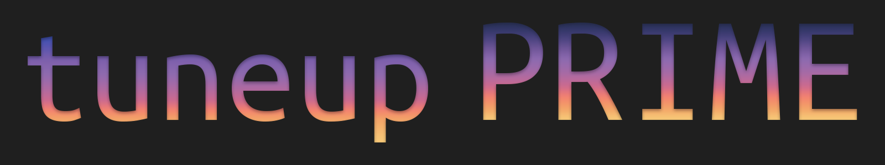
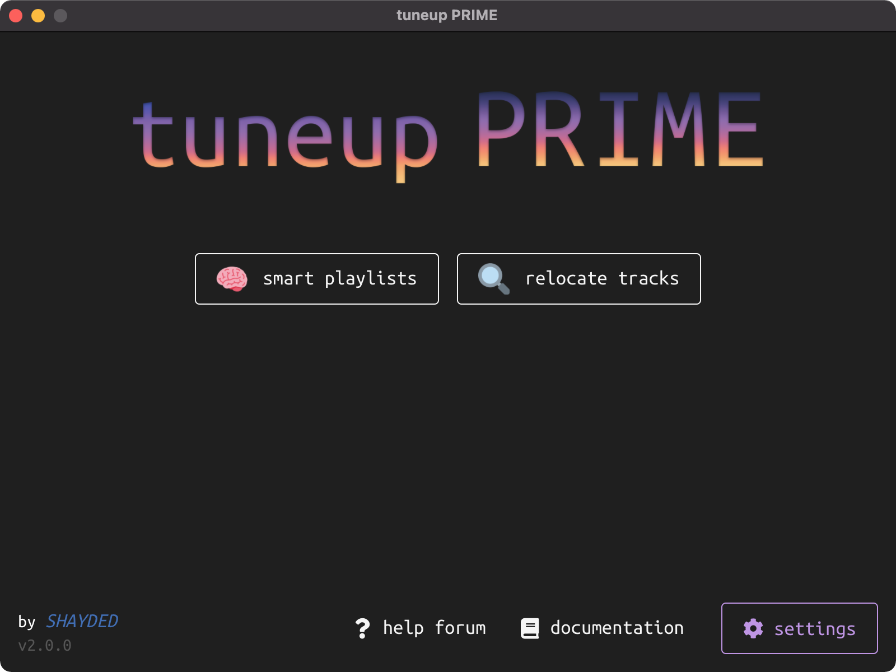
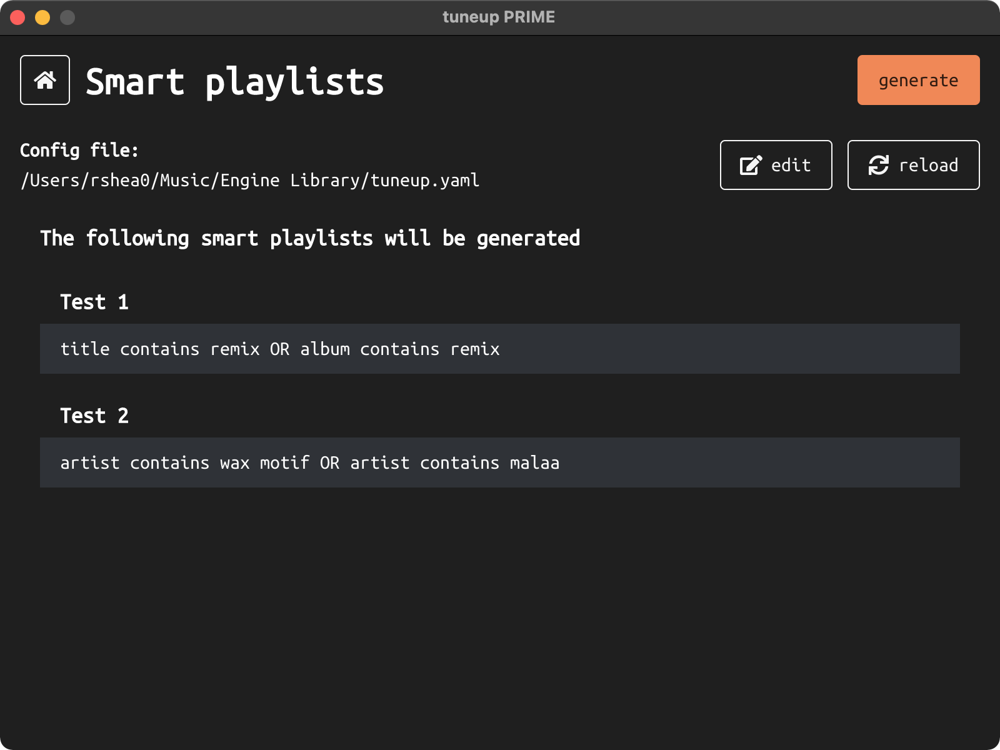
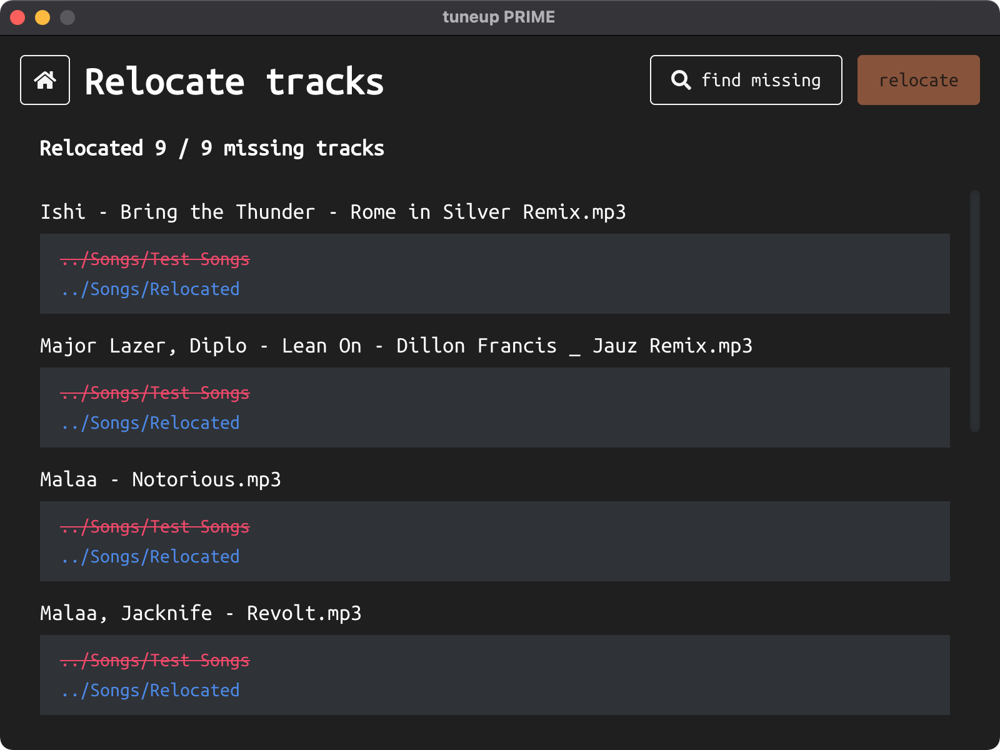
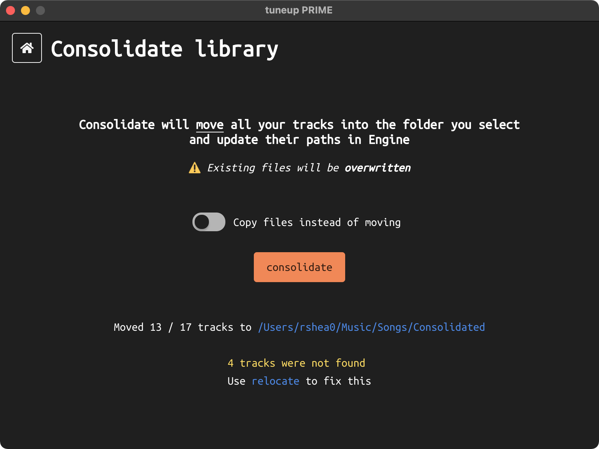

#### A library management toolkit for Denon Engine PRIME 🎧

&nbsp;&nbsp;_by [SHAYDED](http://shayded.com)_

- 🚀 [Installation](#-installation)
- ❓ [How To Use](#-how-to-use)
  - 🧠 [`smart playlists`](#-smart-playlists)
  - 🔍 [`relocate tracks`](#-relocate-tracks)
  - 🗃 [`consolidate library`](#-consolidate-library)
    <!-- - 📼 [`import usb playlists`](#-import-usb-playlists) -->

## 🌟 Features

- Easy to use graphic interface
- Smart playlists
  - Generate playlists based off of easily configurable rules
  - Filter tracks based on album, file type, and more
  - Use different operators to filter attributes including Regex
  - Logically group filters with `and` & `or`
- Track relocation
  - Relocate missing tracks
  - Provide a folder to search for tracks in
- Library consolidation
  - Move all your tracks into one folder
    <!-- - Import playlists created on smart consoles like the Prime 4 or SC6000 -->
- Automatically backs up library before running
- Supports Engine 1.6.x
- Cross platform - Windows & macOS
- More coming soon! Check out the [upcoming features](https://github.com/rshea0/tuneup-prime/issues?q=is%3Aissue+is%3Aopen+sort%3Aupdated-desc+label%3A%22new+feature%22)

If there's a feature you'd like added that would be useful to you, [suggest it here](https://github.com/rshea0/tuneup-prime/discussions/new)!

## 🚀 Installation

You can try tuneup PRIME free for 14 days. Simply download the latest version from the [releases page](https://github.com/rshea0/tuneup-prime/releases).

tuneup PRIME can be purchased on [Gumroad](https://gum.co/tuneup-prime). Pricing is pay-what-you-want (\$3 minimum).

After purchasing, simply download and run the installer.

### Activating

After your trial expires, tuneup PRIME must be activated with a license key. Simply click the "activate" button on the home page and paste in your license key.

> tuneup PRIME only requires an internet connection during activation and never again.

### Updating

tuneup PRIME will notify you when an update is available and show a button to download the latest version.

> Adding full auto updates would require me to code-sign the app on macOS. This requires a \$99/yr Apple developer subscription which I currently can't afford. Please consider paying above the minimum to both help me have more time to develop this app as well as afford this subscription.

## ❓ How To Use

Simply select one of the tools in the middle of the page to get started!

### 🧠 Smart Playlists

Allows you to generate smart playlists based off easily definable sets of rules.

Click "edit" to open the config file in your default text editor.

See the [examples](examples/tuneup.example.yaml) to learn how to define smart playlists.

After editing, click "reload" to see your changes.

Lastly, click "generate" to create your playlists! Each playlist will show a badge indicating how many songs were added to it.

> ⚠️ If a playlist already exists with the same name as one of your smart playlists **IT WILL BE OVERWRITTEN**. In most cases this is desired, as you'll want to update your existing smart playlists.

> tuneup PRIME will automatically create the `tuneup.yaml` config file in your Engine library folder.

### 🔍 Relocate Tracks

Finds tracks in your library that are missing, because you've moved the files to a new folder.

First, click "find missing". Tuneup PRIME will scan your library for tracks that can't be found by Engine. Once the scan is complete, you'll see a list of all the missing tracks detected.

Next, click "relocate". You'll be prompted to select the folder to search for your tracks in. It will also search up to 5 sub-folders deep. After searching, you'll see an updated list of your tracks and their detected location.

> Currently, the filenames have to be the same, but soon you'll be able to specify rules for matching filenames as well as rename individual files.

### 🗃 Consolidate Library

Does what it says on the tin.

<!--
### 📼 Import USB Playlists

Imports playlists created on smart consoles like the Prime 4 or SC6000.

tuneup PRIME will look for USB drives that contain Engine libraries. It will ask you to select which drive to import from. After selecting a drive, it will ask you which playlists you want to import.
-->
