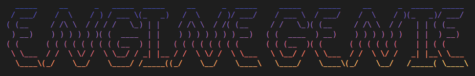

#### A library management tool for Denon Engine PRIME

#### By [SHAYDED](http://shayded.com)

- [Installation](#installation)
- [How To Use](#how-to-use)
- [Commands](#commands)

## Features

- Smart playlists
  - Generate playlists based off of easily configurable rules
  - Filter tracks based on album, file type, and more
  - Use different operators to filter attributes including Regex
  - Logically group filters with `and` & `or`
- Library relocation
  - Relocate missing tracks
  - Provide a folder to search for tracks in
- Automatically backs up library before running
- Supports Engine 1.6 and Engine 2.0 Beta
- Cross platform
  - Windows & macOS

If there's a feature you'd like added that would be useful to you, please open a [feature request](https://github.com/rshea0/engine-genie/issues/new/choose)!

## Installation

Requires NodeJS v14+
_Standalone version coming soon_

```
$ npm install -g engine-genie
$ engine-genie
```

## How To Use

```
$ engine-genie [COMMAND]
```

[Available commands](#commands)

The first time you run a command, it will ask you to enter the location of your Engine library.

If you would like to change this later, you can edit the config file.

In the future, you'll be able to specify multiple Engine libraries and even switch between them (possibly, let me know if you think this would be useful).

#### Config file locations:

- Windows: `%APPDATA%\engine-genie-nodejs\Config\config.yaml`
- macOS: `~Library/Preferences/engine-genie-nodejs/config.yaml`

## Commands

- [`smart` - Generate smart playlists](#smart)
- [`relocate` - Relocate missing tracks](#relocate)

### Smart

Generates smart playlists based off a config file located in your Engine library folder.

```
$ engine-genie smart
```

To configure the smart playlists, place a file called `engine-genie.yaml` in your Engine library folder. See the [examples](examples/engine-genie.yaml) to learn how to define playlists.

If a playlist already exists (at the root level) with the same name as one of your smart playlists **IT WILL BE OVERWRITTEN**. In most cases this is desired, as you'll want to update your smart playlists.

### Relocate

Finds tracks in your library that are missing, because you've moved the files to a new folder.

```
$ engine-genie relocate
```

Engine Genie will scan your library for tracks that are missing on disk. It will then ask you to specify a folder to search for your tracks in. It will also search up to 5 subfolders deep. After searching, it will print out the relocated tracks and their new paths.

Currently, the filenames have to be the same, but soon you'll be able to specify rules for matching filenames as well as rename individual files.
